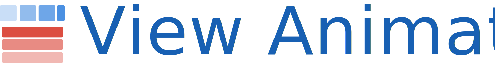

<!--# ViewAnimator-->



**ViewAnimator** is a library for building iOS view animations. It provides a UIView extension which makes adding animations to an entire screen a simple task.


[](http://cocoapods.org/pods/ViewAnimator)


[](http://cocoapods.org/pods/ViewAnimator)
[](http://cocoapods.org/pods/ViewAnimator)


asd


## Installation

### CocoaPods

SwipeableTabBarController is available through [CocoaPods](http://cocoapods.org). To install
it, simply add the following line to your Podfile:

```ruby
pod "ViewAnimator"
```

<!--### Swift Package Manager-->


### Manual

Drop the swift files inside of [ViewAnimator/Classes](https://github.com/marcosgriselli/ViewAnimator/tree/master/ViewAnimator/Classes) into your project.

## Project Details

### Requirements
* Swift 4.0
* Xcode 8.0+
* iOS 9.0+

### Contributing
Feel free to collaborate with ideas 💭, issues ⁉️ and/or pull requests 🔃.

If you use SwipeableTabBarController in your app I'd love to hear about it and feature your animation here!

### Author

Marcos Griselli | <a href="url"></a> [@marcosgriselli](https://twitter.com/marcosgriselli)


[](https://twitter.com/marcosgriselli)

### License

> Copyright (c) 2017 Marcos Griselli

> Permission is hereby granted, free of charge, to any person obtaining a copy
of this software and associated documentation files (the "Software"), to deal
in the Software without restriction, including without limitation the rights
to use, copy, modify, merge, publish, distribute, sublicense, and/or sell
copies of the Software, and to permit persons to whom the Software is
furnished to do so, subject to the following conditions:

> The above copyright notice and this permission notice shall be included in
all copies or substantial portions of the Software.

> THE SOFTWARE IS PROVIDED "AS IS", WITHOUT WARRANTY OF ANY KIND, EXPRESS OR
IMPLIED, INCLUDING BUT NOT LIMITED TO THE WARRANTIES OF MERCHANTABILITY,
FITNESS FOR A PARTICULAR PURPOSE AND NONINFRINGEMENT. IN NO EVENT SHALL THE
AUTHORS OR COPYRIGHT HOLDERS BE LIABLE FOR ANY CLAIM, DAMAGES OR OTHER
LIABILITY, WHETHER IN AN ACTION OF CONTRACT, TORT OR OTHERWISE, ARISING FROM,
OUT OF OR IN CONNECTION WITH THE SOFTWARE OR THE USE OR OTHER DEALINGS IN
THE SOFTWARE.
